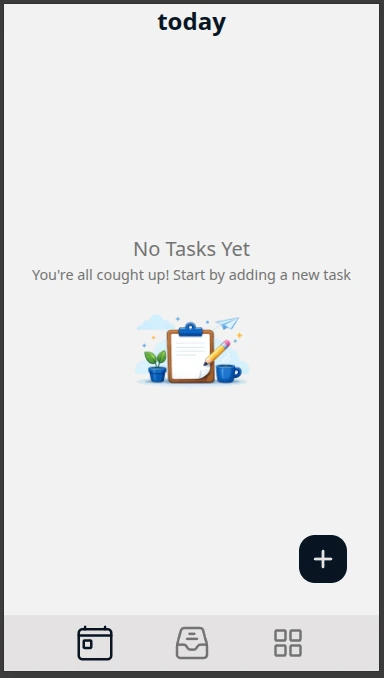
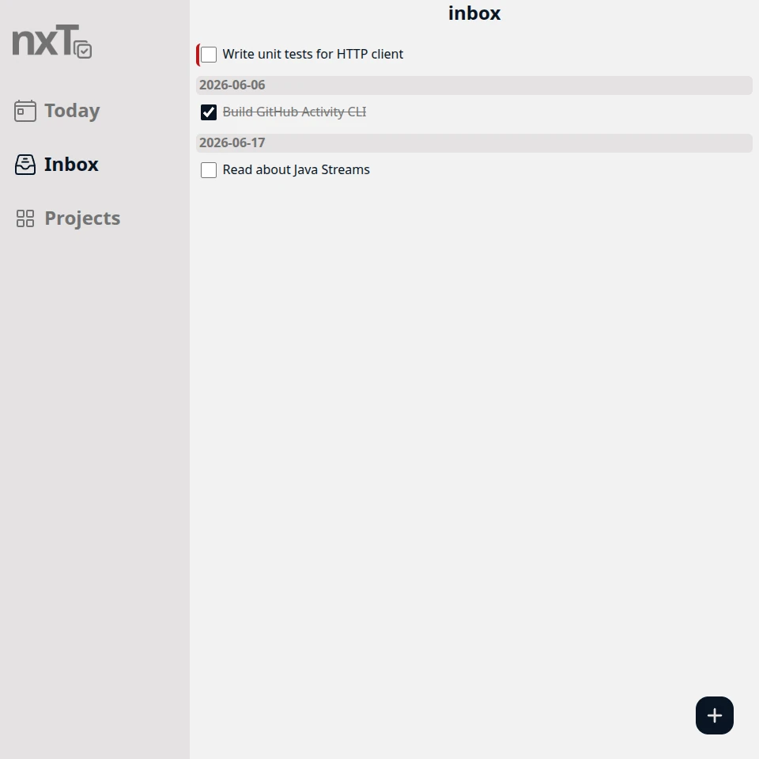
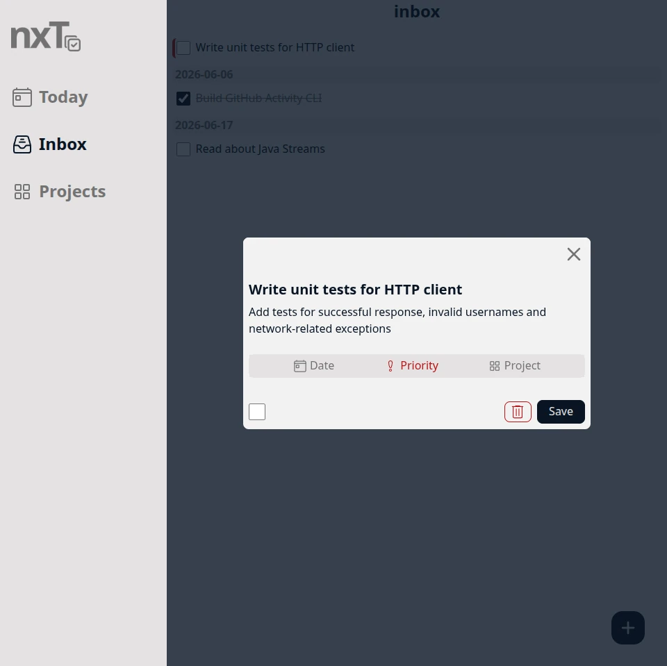

# nxT

A task management application built with vanilla JavaScript that allows users to create, organize, and track tasks through a clean and responsive interface.

## Features

- Create, edit, and delete tasks
- Mark tasks as completed
- Create and manage projects
- Assign tasks to specific projects
- View tasks by project
- Modal-based task creation and editing
- Empty state handling
- Persistent data storage
- Responsive design
- Full keyboard-only navigation (including modal control and task interactions)

## Screenshots

### Dashboard

### Task Modal

## Built With

- JavaScript (ES6+)
- HTML5
- CSS3
- Webpack
- IndexedDB

## Architecture Highlights

### Project & Task Management

Tasks can be organized into projects, making it easier to manage larger collections of work. The application maintains relationships between projects and their associated tasks while keeping the UI synchronized with the underlying data.

### IndexedDB Persistence

Tasks are stored in IndexedDB, allowing data to persist between browser sessions while providing a scalable solution for client-side storage.

### Event Bus System

The application uses a custom event bus to enable communication between independent modules. This approach reduces direct dependencies between components and helps maintain a modular architecture.

### Centralized Modal Management

A dedicated modal system manages opening and closing dialogs throughout the application. The system ensures that only one modal can be active at a time and provides a consistent user experience across different forms and actions.

### Modular Structure

The application is organized into separate modules responsible for:

- UI rendering
- Task management
- Storage operations
- Event handling
- Utility functions